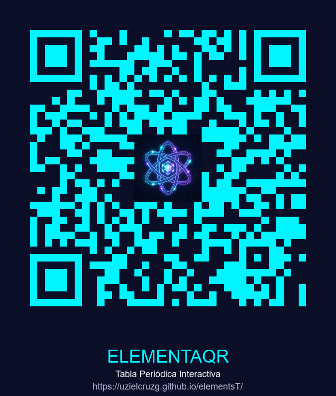

# 🧪 Tabla Periódica Interactiva

Aplicación web educativa para explorar los 118 elementos químicos con datos científicos completos, animaciones fluidas y diseño responsivo.

## 🌐 Demo en Vivo
**👉 [Acceder a la Tabla Periódica](https://uzielcruzg.github.io/elementsT/)**

## 📱 Acceso Rápido

  
   
  <em>Escanea el código QR para acceder desde tu móvil</em>

## ✨ Características

- 🔬 **118 elementos completos** con propiedades físicas y químicas
- 🔍 **Búsqueda inteligente** por nombre, símbolo o número atómico
- 🎨 **9 categorías** con código de colores
- 📊 **Información detallada**: configuración electrónica, descubrimiento, usos
- 📱 **Diseño responsivo** para móvil, tablet y escritorio
- ⚡ **Animaciones fluidas** con estética científico-futurista

## 🛠️ Tecnologías

- React 18
- CSS3 (Grid, Flexbox, Animaciones)
- HTML5
- Google Fonts (Orbitron, Rajdhani)

## 💡 Uso Educativo

Perfecto para:
- Estudiantes de química
- Profesores (material de apoyo)
- Laboratorios científicos
- Ferias de ciencias

## 📄 Licencia

Proyecto educativo de código abierto.

## 👨‍💻 Autor

Creado por [Uziel Cruz](https://github.com/UzielCruzG)

---
